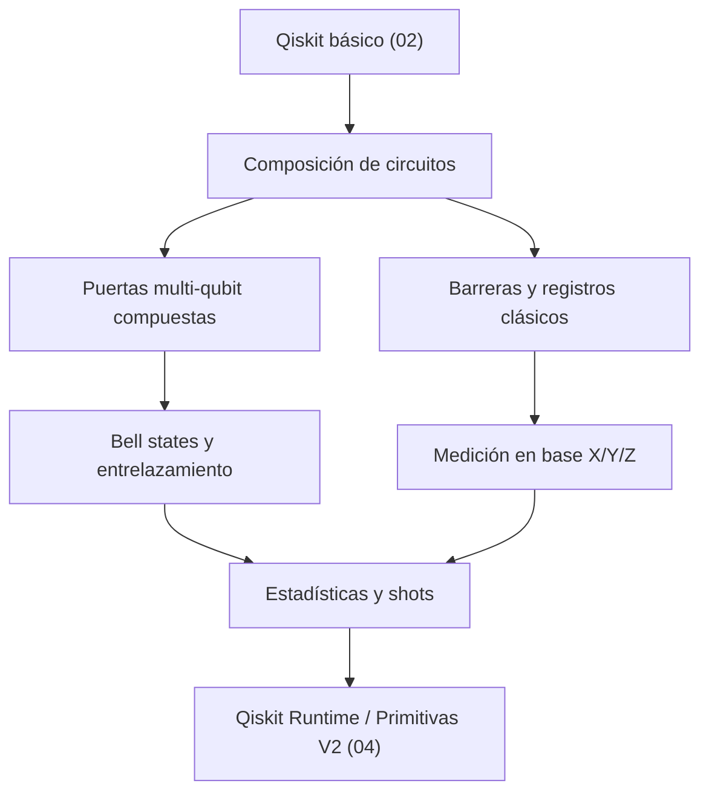

# Módulo 03. Circuitos cuánticos: composición, medición y Bell states

Este módulo conecta el manejo básico de Qiskit (módulo 02) con el uso de Primitivas V2 y algoritmos (módulos 04–05). Se centra en construir circuitos más complejos, medir en distintas bases y producir entrelazamiento controlado.

## Contenido

- [01_composicion_de_circuitos.md](01_composicion_de_circuitos.md) — puertas compuestas, barreras, registros clásicos, reutilización de subcircuitos
- [02_medicion_y_estadisticas.md](02_medicion_y_estadisticas.md) — medición en bases X/Y/Z, shots, distribuciones, error estocástico

## Mapa del módulo

## Foco

Dominar la construcción y medición de circuitos cuánticos no triviales en Qiskit antes de pasar al modelo de ejecución basado en Primitivas. Al terminar este módulo el lector debe ser capaz de:

1. Componer circuitos multi-qubit con puertas parametrizadas y barreras.
2. Preparar y verificar los cuatro estados de Bell.
3. Medir en cualquier base de Pauli e interpretar la distribución de resultados.
4. Entender cómo el número de shots afecta la precisión estadística.
