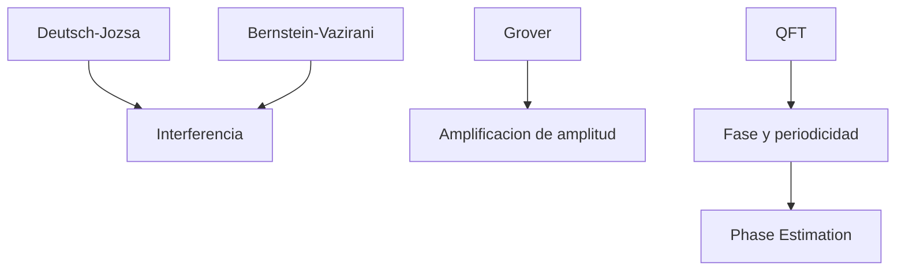

# Modulo 05. Algoritmos cuanticos

## Contenido

- `01_deutsch_jozsa.md`
- `02_bernstein_vazirani.md`
- `03_grover.md`
- `04_transformada_cuantica_de_fourier.md`
- `05_phase_estimation.md`

## Mapa del modulo

## Foco

Introducir la logica interna de varios algoritmos cuanticos elementales y mostrar como usan superposicion, fase e interferencia para extraer informacion util.
