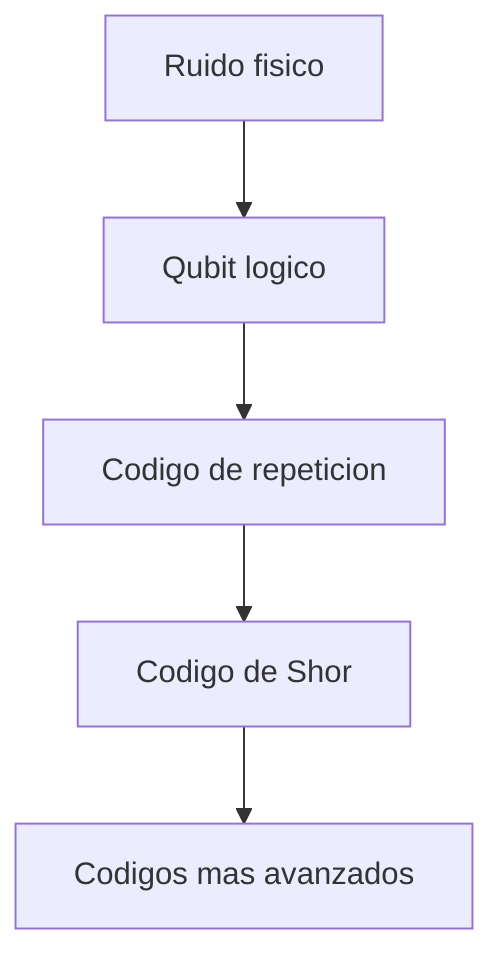

# Modulo 09. Correccion de errores cuanticos

## Contenido

- `01_qubit_logico_y_codigo_de_repeticion.md`
- `02_codigo_de_shor_intuicion.md`

## Mapa del modulo

## Foco

Introducir la intuicion de la correccion de errores cuanticos, distinguiendola claramente de la mitigacion de errores y del simple uso de redundancia clasica.
