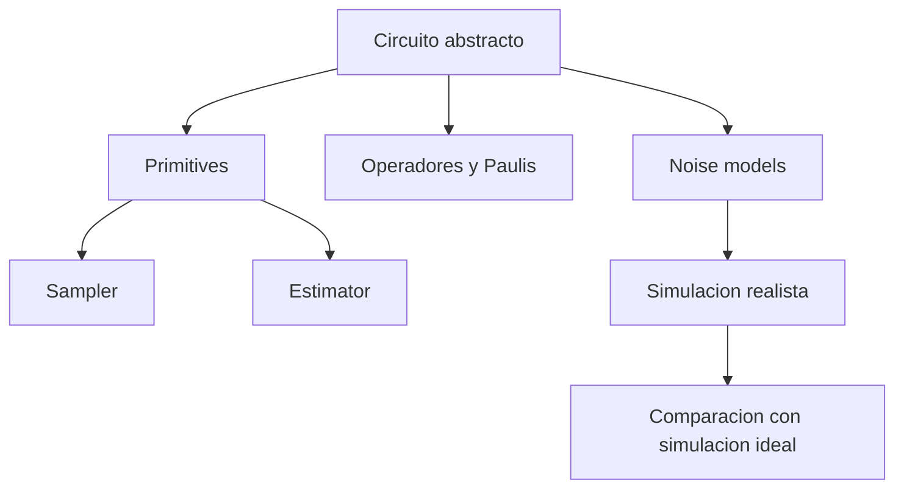

# Modulo 10. Qiskit avanzado

## Contenido

- `01_sampler_estimator_y_primitives.md`
- `02_operator_y_paulis.md`
- `03_noise_models_y_simulacion_realista.md`

## Mapa del modulo

## Foco

Profundizar en la capa de Qiskit que aparece cuando dejamos atras los primeros circuitos y empezamos a trabajar con interfaces mas altas, operadores, modelos de ruido y comparaciones mas realistas.
