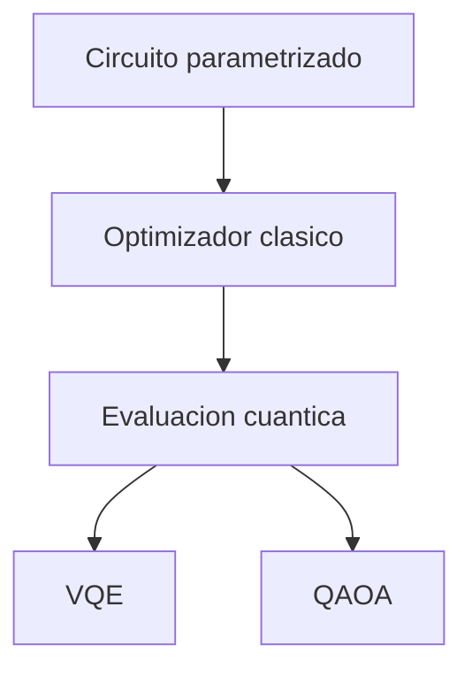

# Modulo 11. Algoritmos variacionales

## Contenido

- `01_circuitos_parametrizados_y_optimizacion.md`
- `02_vqe_intuicion.md`
- `03_qaoa_intuicion.md`

## Mapa del modulo

## Foco

Introducir la familia de algoritmos híbridos donde la computación cuántica y la optimización clásica trabajan juntas de manera iterativa.
