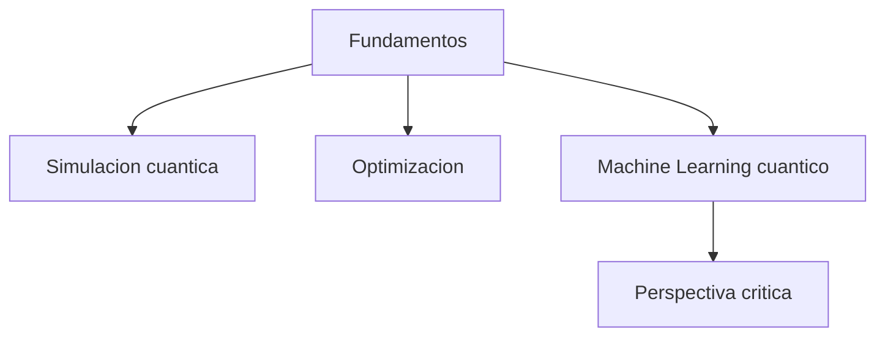

# Modulo 12. Aplicaciones

## Contenido

- `01_quimica_cuantica_y_simulacion.md`
- `02_optimizacion.md`
- `03_machine_learning_cuantico_con_perspectiva_critica.md`

## Mapa del modulo

## Foco

Mostrar algunas de las grandes areas de aplicacion de la computacion cuantica sin perder una mirada critica sobre el estado real del campo.
