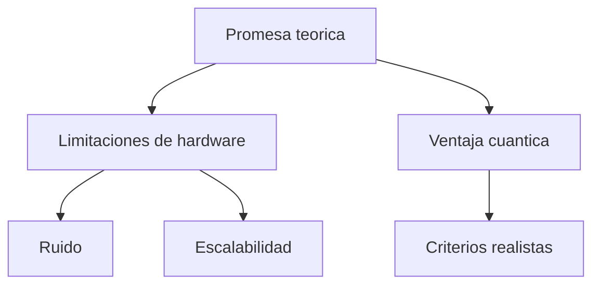

# Modulo 13. Limites actuales y realismo

## Contenido

- `01_que_puede_y_que_no_puede_hacer_la_computacion_cuantica_hoy.md`
- `02_realismo_sobre_ventaja_cuantica.md`

## Mapa del modulo

## Foco

Equilibrar el entusiasmo del tutorial con una mirada realista sobre el estado actual del campo.
