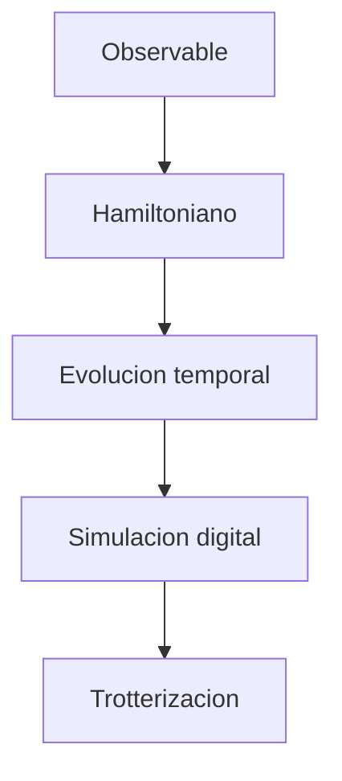

# Modulo 15. Hamiltonianos y evolucion temporal

## Contenido

- `01_observables_y_hamiltonianos.md`
- `02_evolucion_unitaria_y_trotterizacion.md`

## Mapa del modulo

## Foco

Introducir el lenguaje de Hamiltonianos, evolución temporal y simulación digital como paso natural después de algoritmos, información cuántica y Qiskit avanzado.
