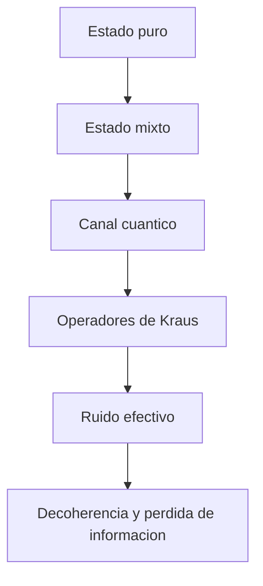

# Modulo 16. Canales cuanticos y ruido

## Contenido

- `01_canales_cuanticos_intuicion_y_representacion.md`
- `02_kraus_decoherencia_y_modelos_efectivos.md`

## Mapa del modulo

## Foco

Dar una primera formulacion util del ruido como transformacion sobre estados, no solo como una molestia experimental. Este modulo conecta matrices de densidad, hardware, simulacion y modelos efectivos de decoherencia.
