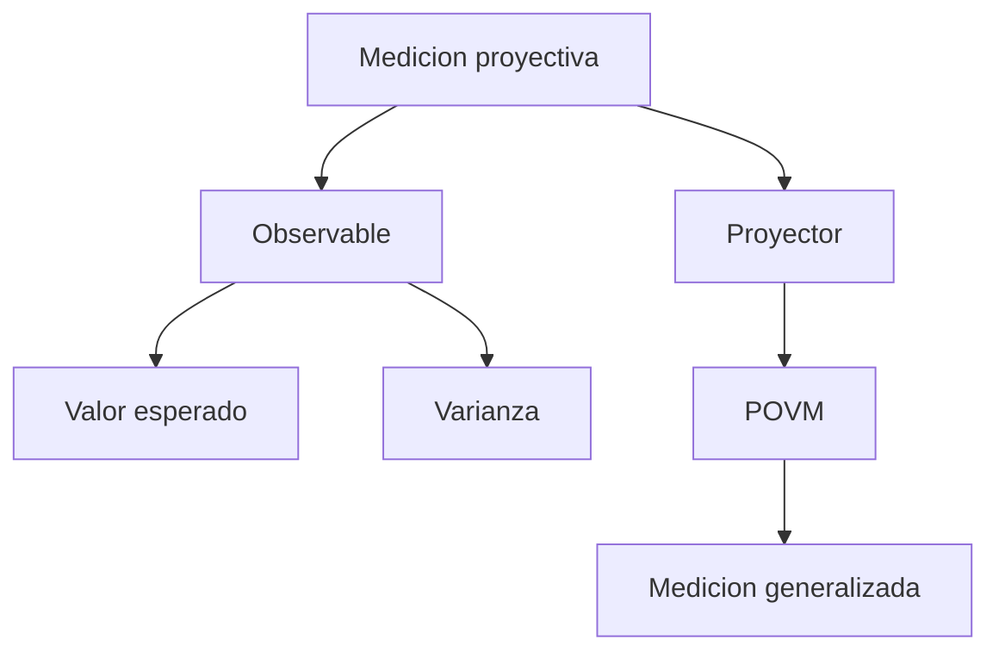

# Modulo 17. Medicion avanzada y observables

## Contenido

- `01_proyectores_valores_esperados_y_varianza.md`
- `02_povm_intuicion_y_medicion_generalizada.md`

## Mapa del modulo

## Foco

Refinar la nocion de medicion para que el lector pueda pasar de resultados binarios simples a observables, dispersion, proyectores y una primera intuicion de mediciones mas generales.
