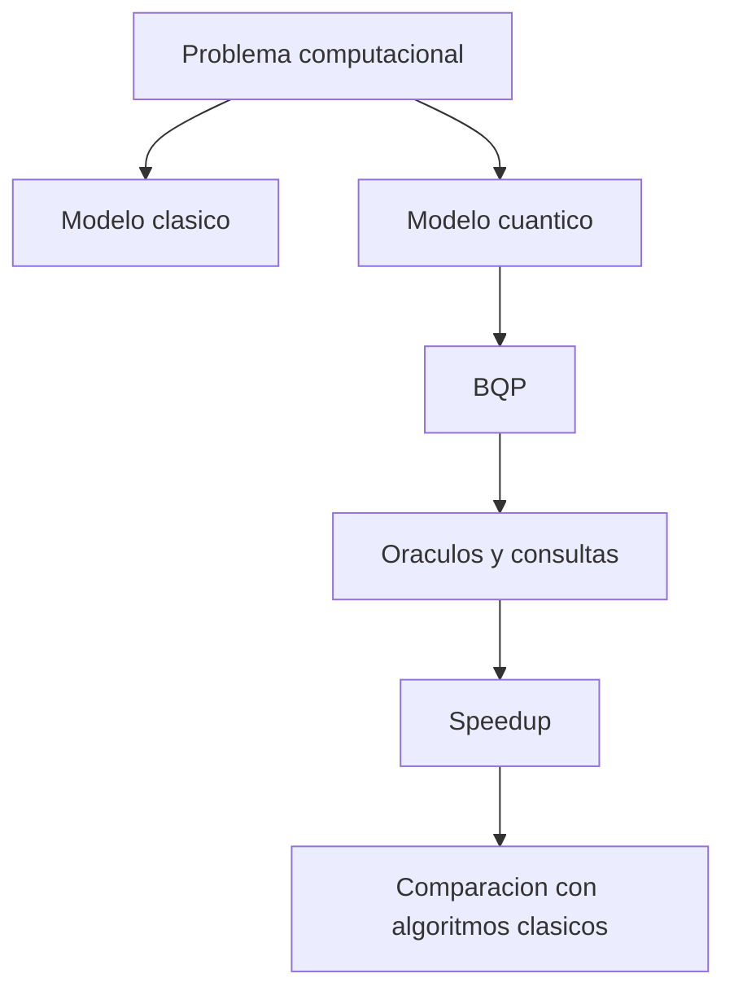

# Modulo 18. Complejidad cuantica

## Contenido

- `01_bqp_oraculos_y_speedup.md`
- `02_limites_de_la_ventaja_y_comparacion_clasica.md`

## Mapa del modulo

## Foco

Dar una primera imagen seria de por que la computacion cuantica no consiste solo en circuitos interesantes, sino en comparar modelos de computacion, clases de problemas y condiciones reales de ventaja.
