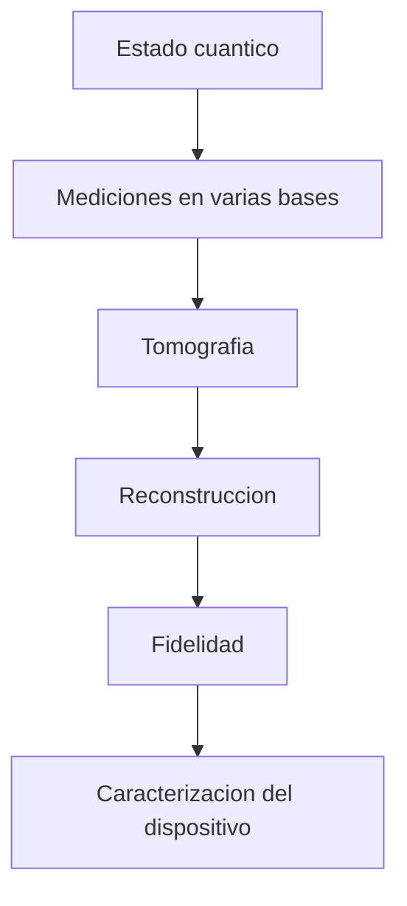

# Modulo 19. Tomografia y caracterizacion

## Contenido

- `01_tomografia_de_estados_intuicion_y_reconstruccion.md`
- `02_fidelidad_y_caracterizacion_operacional.md`

## Mapa del modulo

## Foco

Introducir la idea de reconstruir informacion sobre estados y procesos a partir de mediciones, y enlazar esa reconstruccion con fidelidad, ruido y evaluacion de hardware.
