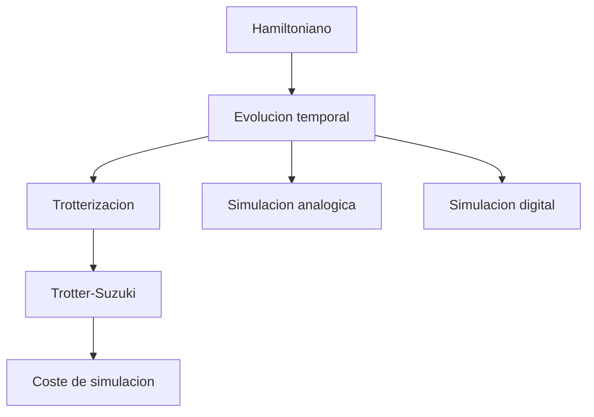

# Modulo 20. Simulacion cuantica avanzada

## Contenido

- `01_trotter_suzuki_y_coste_de_simulacion.md`
- `02_simulacion_digital_frente_a_analogica.md`

## Mapa del modulo

## Foco

Dar un paso mas alla del lenguaje introductorio de Hamiltonianos y mostrar que la simulacion cuantica abre preguntas de aproximacion, coste, precision y arquitectura.
