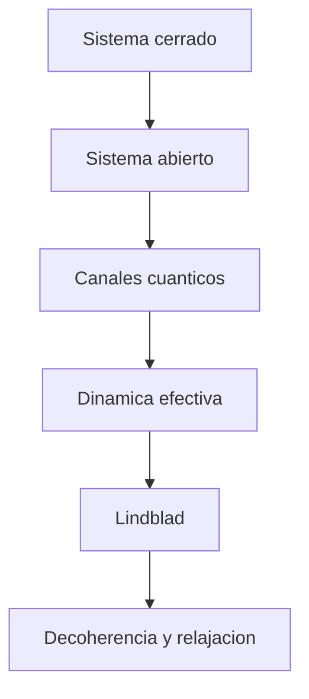

# Modulo 21. Open quantum systems

## Contenido

- `01_lindblad_y_dinamica_efectiva.md`
- `02_decoherencia_relajacion_y_markovianidad.md`

## Mapa del modulo

## Foco

Profundizar la idea de sistemas abiertos para que el ruido no quede solo como un conjunto de ejemplos discretos, sino como parte de una dinamica efectiva mas general.

## Relacion con otros bloques

- prolonga [16_canales_cuanticos_y_ruido](../16_canales_cuanticos_y_ruido/README.md);
- dialoga con [19_tomografia_y_caracterizacion](../19_tomografia_y_caracterizacion/README.md);
- prepara una lectura mas madura de [13_limites_actuales_y_realismo](../13_limites_actuales_y_realismo/README.md).
