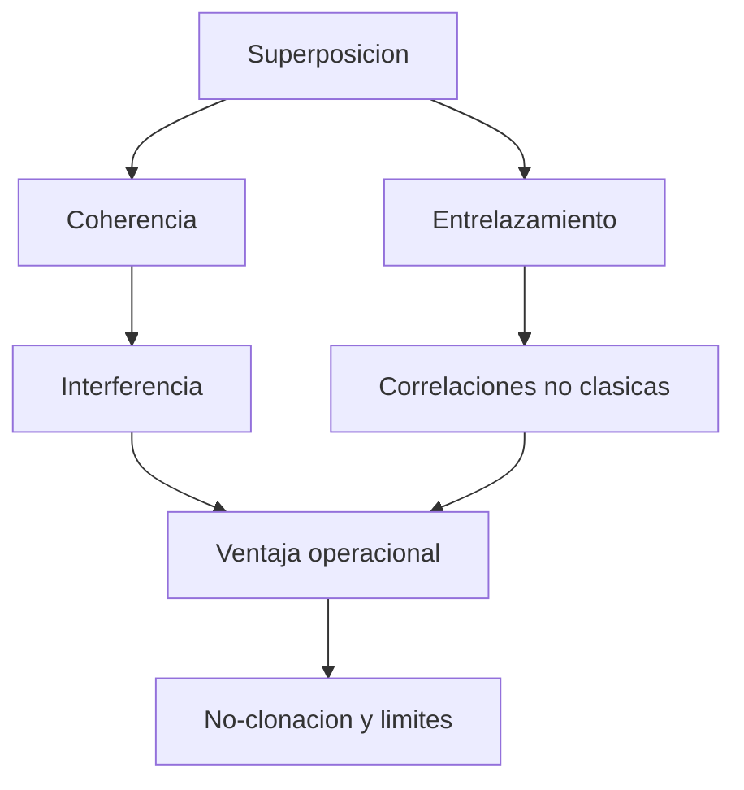

# Modulo 22. Recursos cuanticos

## Contenido

- `01_coherencia_entrelazamiento_y_utilidad.md`
- `02_no_clonacion_y_limites_operacionales.md`

## Mapa del modulo

## Foco

Identificar algunos de los recursos especificamente cuanticos que hacen posible una parte importante del comportamiento no clasico de los sistemas y algoritmos estudiados en el curso.

## Relacion con otros bloques

- conecta con [04_entrelazamiento_y_estados_de_bell.md](../04_entrelazamiento_y_estados_de_bell.md);
- ayuda a reinterpretar [18_complejidad_cuantica](../18_complejidad_cuantica/README.md);
- da contexto adicional al bloque [13_limites_actuales_y_realismo](../13_limites_actuales_y_realismo/README.md).
