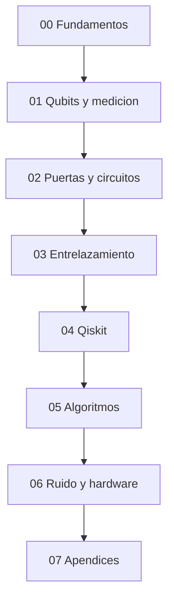

# Indice general del tutorial

Este indice resume la arquitectura actual del proyecto y sirve como punto de entrada alternativo a `Tutorial/README.md`.

## Mapa del recorrido

## Modulos

### `00_fundamentos/`

Base conceptual y matematica minima para leer el resto del curso.

### `01_qubits_y_medicion/`

Qubits, superposicion, bases, medicion y esfera de Bloch.

### `02_puertas_y_circuitos/`

Puertas unitarias, circuitos y estructura operativa de la computacion cuantica.

### `03_entrelazamiento/`

Estados de Bell, correlaciones no clasicas y estados reducidos.

### `04_qiskit/`

Simuladores, estado vector, cuentas, transpilacion y flujo de trabajo practico con Qiskit.

### `05_algoritmos/`

Deutsch-Jozsa, Bernstein-Vazirani, Grover y QFT.

### `06_ruido_y_hardware/`

Decoherencia, fidelidad, mitigacion de errores y paso hacia hardware real.

### `07_apendices/`

Bibliografia comentada, referencias y material de apoyo.

## Cuadernos asociados

La carpeta `../Cuadernos/` se organiza ahora en tres niveles:

- `ejemplos/` para ideas concretas;
- `problemas_resueltos/` para desarrollos guiados;
- `laboratorios/` para exploracion mas abierta.
