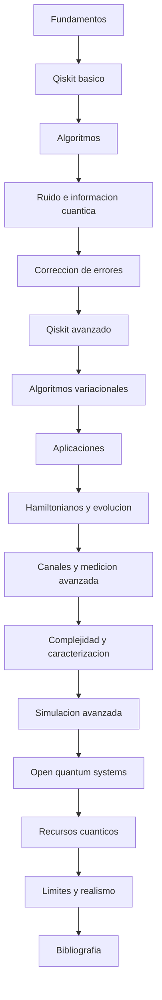

# Indice general del tutorial

Este indice resume la arquitectura actual del curso y complementa a [README.md](README.md) con una vista mas estructural del recorrido.

## Mapa global

## Bloques del curso

### Fundamentos iniciales

- [01_qubits_y_estados.md](01_fundamentos/01_qubits_y_estados.md)
- [02_superposicion_medicion_y_esfera_de_bloch.md](01_fundamentos/02_superposicion_medicion_y_esfera_de_bloch.md)
- [03_puertas_cuanticas_y_circuitos.md](01_fundamentos/03_puertas_cuanticas_y_circuitos.md)
- [04_entrelazamiento_y_estados_de_bell.md](01_fundamentos/04_entrelazamiento_y_estados_de_bell.md)
- [05_qiskit_primeros_pasos.md](02_qiskit_basico/05_qiskit_primeros_pasos.md)
- [06_algebra_lineal_minima_para_computacion_cuantica.md](01_fundamentos/06_algebra_lineal_minima_para_computacion_cuantica.md)
- [07_algoritmos_cuanticos_introductorios.md](01_fundamentos/07_algoritmos_cuanticos_introductorios.md)

### Qiskit y flujo de ejecucion

- [08_qiskit_simuladores_estado_y_resultados.md](02_qiskit_basico/08_qiskit_simuladores_estado_y_resultados.md)
- [09_qiskit_transpilacion_ruido_y_hardware.md](02_qiskit_basico/09_qiskit_transpilacion_ruido_y_hardware.md)
- [04_qiskit/01_qiskit_runtime_y_primitives.md](04_qiskit/01_qiskit_runtime_y_primitives.md)
- [10_qiskit_avanzado/README.md](10_qiskit_avanzado/README.md)

### Algoritmos

- [05_algoritmos/README.md](05_algoritmos/README.md)
- [11_algoritmos_variacionales/README.md](11_algoritmos_variacionales/README.md)

### Ruido, informacion y correccion

- [06_ruido_y_hardware/README.md](06_ruido_y_hardware/README.md)
- [08_informacion_cuantica/README.md](08_informacion_cuantica/README.md)
- [09_correccion_errores/README.md](09_correccion_errores/README.md)
- [14_surface_codes_y_horizonte_fault_tolerant/README.md](14_surface_codes_y_horizonte_fault_tolerant/README.md)

### Aplicaciones y fisica computacional

- [12_aplicaciones/README.md](12_aplicaciones/README.md)
- [15_hamiltonianos_y_evolucion_temporal/README.md](15_hamiltonianos_y_evolucion_temporal/README.md)

### Estructuras avanzadas del estado y la medida

- [16_canales_cuanticos_y_ruido/README.md](16_canales_cuanticos_y_ruido/README.md)
- [17_medicion_avanzada_y_observables/README.md](17_medicion_avanzada_y_observables/README.md)

### Complejidad, caracterizacion y simulacion

- [18_complejidad_cuantica/README.md](18_complejidad_cuantica/README.md)
- [19_tomografia_y_caracterizacion/README.md](19_tomografia_y_caracterizacion/README.md)
- [20_simulacion_cuantica_avanzada/README.md](20_simulacion_cuantica_avanzada/README.md)
- [21_open_quantum_systems/README.md](21_open_quantum_systems/README.md)
- [22_recursos_cuanticos/README.md](22_recursos_cuanticos/README.md)

### Cierre y apoyo

- [13_limites_actuales_y_realismo/README.md](13_limites_actuales_y_realismo/README.md)
- [07_apendices/bibliografia_comentada.md](07_apendices/bibliografia_comentada.md)

## Material practico asociado

La carpeta [../Cuadernos](../Cuadernos/README.md) se organiza en tres niveles:

- `ejemplos/` para ideas concretas;
- `problemas_resueltos/` para desarrollos guiados;
- `laboratorios/` para exploracion mas abierta.

## Criterio de lectura

- la primera mitad del curso busca continuidad entre fundamentos, Qiskit y algoritmos;
- la segunda mitad reorganiza el campo por capas: ruido, caracterizacion, simulacion, sistemas abiertos, recursos y limites;
- [Tutorial/README.md](README.md) mantiene la ruta lineal principal, mientras que este indice agrupa por familias tematicas.
