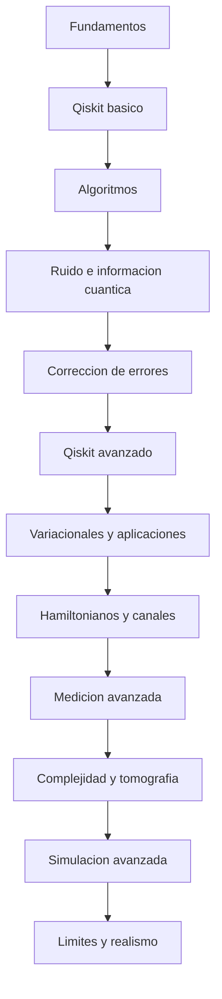
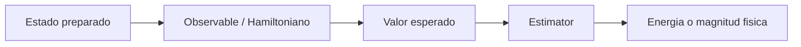
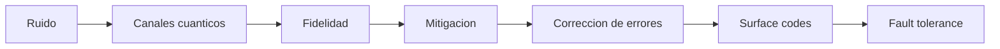
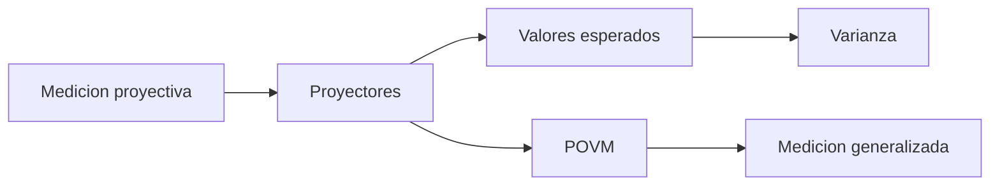

# Mapa visual del curso

## Vista global

```mermaid
flowchart TD
    A["Fundamentos"] --> B["Qiskit basico"]
    B --> C["Algoritmos"]
    C --> D["Ruido e informacion cuantica"]
    D --> E["Correccion de errores"]
    E --> F["Qiskit avanzado"]
    F --> G["Variacionales y aplicaciones"]
    G --> H["Hamiltonianos y canales"]
    H --> I["Medicion avanzada"]
    I --> J["Complejidad y tomografia"]
    J --> K["Simulacion avanzada"]
    K --> L["Limites y realismo"]
```

## Flujo de observables y energia

```mermaid
flowchart LR
    A["Estado preparado"] --> B["Observable / Hamiltoniano"]
    B --> C["Valor esperado"]
    C --> D["Estimator"]
    D --> E["Energia o magnitud fisica"]
```

## Del ruido a fault tolerance

```mermaid
flowchart LR
    A["Ruido"] --> B["Canales cuanticos"]
    B --> C["Fidelidad"]
    C --> D["Mitigacion"]
    D --> E["Correccion de errores"]
    E --> F["Surface codes"]
    F --> G["Fault tolerance"]
```

## Medicion ampliada

```mermaid
flowchart LR
    A["Medicion proyectiva"] --> B["Proyectores"]
    B --> C["Valores esperados"]
    C --> D["Varianza"]
    B --> E["POVM"]
    E --> F["Medicion generalizada"]
```
